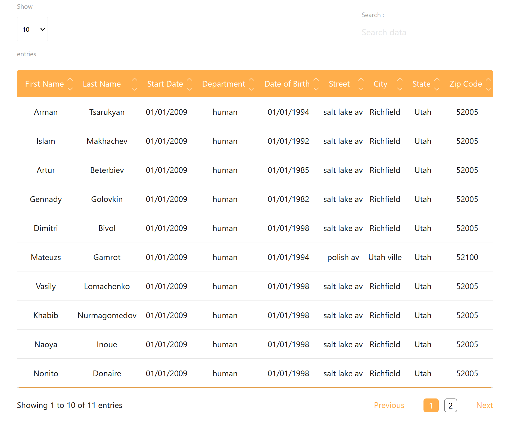

# React Simple Data Table Component

As time-consuming is to developp a React data table, here is a simple table library that would do the job for most of the cases.
It builds a table, as features : pagination, sorting and searching.
No customization is necessary, so it makes the process quite quick and easy.
All it requires is the data and the columns' name, you can also customize the color as needed.

This library has been built with React, TypeScript and Css.



As easy it is to implement, you need to follow these steps to make it work.

# Key Features

- Declarative configuration
- Built-in and configurable:
  - Sorting (desc/asc)
  - Pagination
  - Search
  - Color Customization


# Installation

The documentation contains information about installation, usage and extra recommendations.


## Prerequisites

[NodeJS (version 12.18)](https://nodejs.org/en/)

## Run the following command : 

` npm install simple-react-data-table-component `

# Usage

```ts

import { TableTemplate } from 'simple-react-data-table-component'

const columns = [
  { title: 'First Name', data: 'firstName' },
  { title: 'Last Name', data: 'lastName' },
  { title: 'Start Date', data: 'startDate'},
  { title: 'Department', data: 'department' },
  { title: 'Date of Birth', data: 'dateOfBirth' },
  { title: 'Street', data: 'street' },
  { title: 'City', data: 'city' },
  { title: 'State', data: 'state' },
  { title: 'Zip Code', data: 'zipCode' },
],

const data = [
  {
    firstName: 'Arman',
    lastName: 'Tsarukyan',
    dateOfBirth: new Date('1995'),
    startDate: new Date('2019'),
    department: 'Human',
    street: 'Gumri avenue 55',
    city: 'Erevan',
    state: 'Armenia',
    zipCode: 29005,
  },
  {
    firstName: 'Islam',
    lastName: 'Makhachev',
    dateOfBirth: new Date('1992'),
    startDate: new Date('2018'),
    department: 'Human',
    street: 'Grozny street 111',
    city: 'Makhachkala',
    state: 'Russia',
    zipCode: 52005,
  },
]

const color = 'rgb(255, 174, 75)' | 'rgba(255,0,0,0.3)' | '#ff6347'

ReactDOM.render(<TableTemplate columns={columns} dataInputs={data} color={color} />, document.getElementById('root'));

```

# Extra recommendations

To limit errors, the use of "type" in columns array is recommended as the following example :

```ts

const columns = [
  { title: 'First Name', data: 'firstName', type: TYPE.string },
  { title: 'Last Name', data: 'lastName', type: TYPE.string },
  { title: 'Start Date', data: 'startDate', type: TYPE.date },
  { title: 'Department', data: 'department', type: TYPE.string },
  { title: 'Date of Birth', data: 'dateOfBirth', type: TYPE.date },
  { title: 'Street', data: 'street', type: TYPE.string },
  { title: 'City', data: 'city', type: TYPE.string },
  { title: 'State', data: 'state', type: TYPE.string },
  { title: 'Zip Code', data: 'zipCode', type: TYPE.number },
]

class TYPE {
  string = 'STRING',
  number = 'NUMBER',
  date = 'DATE',
}

```